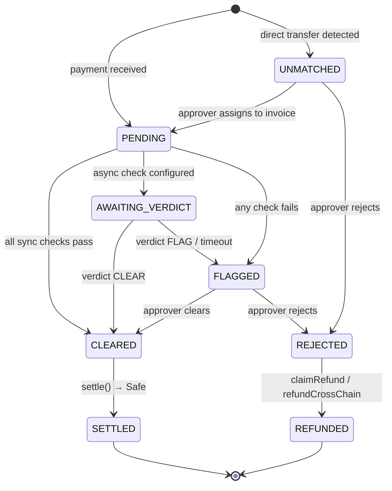
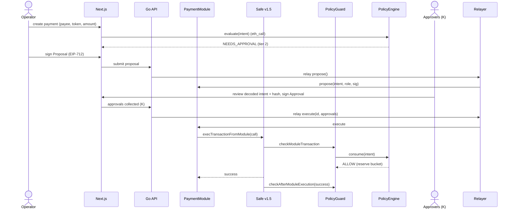
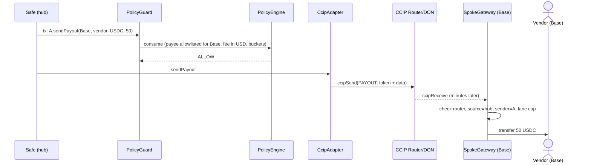
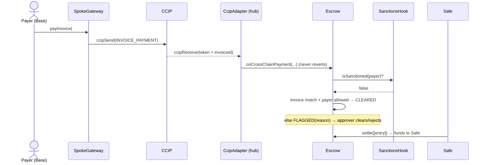
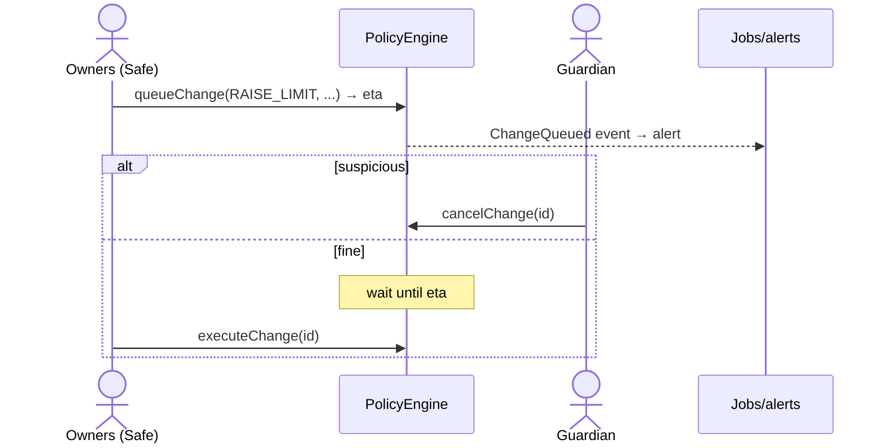

# Step 5b — Solution Design

_Treasury Policy Layer · v1.0 · 2026-09-27. Detailed design for the MVP. Signatures and types are design-level (names may change during the build). Diagrams use Mermaid. Based on `04-tech-discovery.md`, `05a-PRD.md`, D1–D22._

---

## 1. Contract design (hub: Ethereum Sepolia)

### 1.1 Shared types
```
struct Call    { address target; uint256 value; bytes data; uint8 operation; } // 0 = CALL, 1 = DELEGATECALL
struct Intent  { address safe; bytes32 initiatorRole; address initiator; uint64 chainId; Call[] calls; }
enum Decision  { ALLOW, NEEDS_APPROVAL, DENY }
enum PriceStatus { OK, STALE, INVALID, NO_FEED }
struct Verdict { Decision decision; uint8 tier; bytes32 reason; uint256 usdValue; }
```
`reason` codes (bytes32): `PAYEE_NOT_ALLOWED`, `PAYEE_NOT_ACTIVE`, `OVER_PER_TX`, `OVER_BUCKET`, `OVER_HARD_CAP`, `PRICE_UNAVAILABLE`, `FORBIDDEN_CALL`, `DELEGATECALL_BLOCKED`, `SELF_CALL_BLOCKED`, `UNLIMITED_APPROVE`, `HOOK_DENY`, `HOOK_FAILED`, `PAUSED`, `TOO_MANY_CALLS`.

### 1.2 PolicyEngine (UUPS proxy; EIP-7201 namespaced storage)
**Responsibilities:** classify calls → price → rules → tier; own buckets, payees, limits, governance, hooks.

| Function | Who | Notes |
|---|---|---|
| `evaluate(Intent) → Verdict` (view) | anyone (guard, UI, MCP simulate) | Pure decision; no state change |
| `consume(Intent) → Verdict` | PolicyGuard only | Re-evaluates + reserves bucket spend (called in the pre-check) |
| `refund(bytes32 reservationId)` | PolicyGuard only | Called in the post-check if the inner call failed |
| `lowerLimit(role, kind, value)` · `removePayee(chainSel, addr)` · `pause(scope)` | POLICY_ADMIN (tighten) / GUARDIAN (pause) | Immediate |
| `queueChange(ChangeType, bytes payload) → changeId` | POLICY_ADMIN | Loosening: raise limit, add payee, add target/selector, add token/feed, add hook, upgrade, switch token to fixed price |
| `executeChange(changeId)` | anyone after ETA | Applies the queued loosening change |
| `cancelChange(changeId)` | GUARDIAN or POLICY_ADMIN | Veto during the delay |
| `unpause(scope)` | POLICY_ADMIN | Needs the admin quorum (the Safe) |

**Storage (namespaced):**
- `roles[role] → { autoLimitUsd, tier2LimitUsd, perTxCapUsd, approvalsRequired (K) }`
- `buckets[bucketId] → { capacityUsd, ratePerSecUsd, availableUsd, lastUpdate }` (global + per role)
- `hardCapUsd`
- `payees[chainSelector][addr] → { active, activatesAt, labelHash }`
- `allowedTargets[target][selector] → bool` (e.g., CCIP Router `ccipSend`, token `transfer`/`approve`)
- `delegatecallAllowed[target] → bool` (empty in v1)
- `tokens[token] → { feed, heartbeat, isStable, fixedPriceUsd, decimals, maxDeviationBps, lastGoodPrice }`
- `pendingChanges[id] → { type, payload, eta, status }`
- `hooks[] (≤ 3) → { hook, flags, gasLimit }`
- `paused[scope]`, `changeDelay`, `payeeActivationDelay`, `reservations[id]`

**Evaluation order (fixed):**
1. paused?
2. `calls.length ≤ MAX_CALLS`
3. per call: classify shape → forbidden? → payee allowed & active for `(chain, to)`
4. price each token (fail → mark `PRICE_UNAVAILABLE`)
5. sum USD (+ CCIP fee)
6. hard cap
7. per-tx cap
8. buckets (global + role)
9. core tier (auto / tier-2 / owners)
10. hooks (staticcall, gas cap; any DENY wins; failure → NEEDS_APPROVAL)
11. final Verdict

`PRICE_UNAVAILABLE` never yields ALLOW.

**Events:** `Evaluated`, `SpendReserved`, `SpendRefunded`, `LimitLowered`, `PayeeRemoved`, `ChangeQueued(id, type, eta)`, `ChangeExecuted`, `ChangeCancelled`, `Paused`, `Unpaused`, `HookInstalled`, `Upgraded`.

### 1.3 PolicyGuard (immutable; Safe Guard + Module Guard; ERC-165)
- `checkTransaction(...)`: build `Intent` from the Safe tx (initiator role = OWNERS) → `engine.consume` → revert unless ALLOW (owner path: NEEDS_APPROVAL up to the hard cap counts as ALLOW, because owners are the approval).
- `checkAfterExecution(txHash, success)`: `if (!success) engine.refund(...)`.
- `checkModuleTransaction(to, value, data, op, module) → bytes32`: only allowlisted modules (PaymentModule, optional Safe4337Module); build `Intent` with the role provided by the module context → `consume`; must be ALLOW.
- `checkAfterModuleExecution(hash, success)`: refund on failure.
- **Anti-bricking:** always allow the self-call `setGuard(0)` / `setModuleGuard(0)` **if** it matches an executed, time-locked `REMOVE_GUARD` change in the engine (and even if engine calls revert, via try/catch).
- **Decoding:** ETH value; ERC-20 `transfer`/`transferFrom`/`approve`; **`CcipAdapter.sendPayout(destSelector, payee, token, amount)`** (our wrapper around CCIP `ccipSend`, so the guard decodes one simple, known shape) → destination chain + payee + amount + quoted fee; direct calls to the CCIP Router from the Safe → DENY; self-calls; `delegatecall`; MultiSend → DENY in v1.

### 1.4 PaymentModule (immutable; Safe module)
| Function | Notes |
|---|---|
| `propose(Intent, role, signature)` | Operator/Agent EIP-712 `Proposal`; stores `intentHash`, proposer, role, expiry; emits `Proposed(id, verdict)` |
| `execute(proposalId, Approval[] approvals)` | Checks: proposal open, not expired; if the verdict tier needs K approvals → K distinct APPROVERs ≠ proposer, valid EIP-712 signatures over `intentHash`, unused nonces, deadline; then `execTransactionFromModule` for each call (module guard re-checks) |
| `cancel(proposalId)` | Proposer or admin |

**EIP-712 domain:** `{ name: "TreasuryPolicy", version: "1", chainId, verifyingContract: PaymentModule }`
```
Proposal { bytes32 intentHash; bytes32 role; address proposer; uint256 nonce; uint64 deadline; }
Approval { bytes32 proposalId; bytes32 intentHash; address approver; uint256 nonce; uint64 deadline; }
intentHash = keccak256(abi.encode(safe, chainId, keccak256(abi.encode(calls))))
```
Signatures verified with OZ `SignatureChecker` (EOA + EIP-1271).

### 1.5 PriceOracle (config inside the engine, logic in a library/adapter)
`usdValue(token, amount) → (usd18, PriceStatus)`:
`latestRoundData` in try/catch → `answer > 0 && updatedAt != 0` → `block.timestamp - updatedAt ≤ heartbeat + buffer` → deviation vs `lastGoodPrice` ≤ `maxDeviationBps` → normalize decimals → stable floor `max(price, 1e18)` → round **up**. `fixedPriceUsd` for feedless tokens (CCIP-BnM).

### 1.6 InvoiceRegistry + Escrow (immutable; holds funds)
**Invoice:** `{ id, issuer, payerChain, payer (0 = any allowlisted), token, amount, dueDate, docHash, status, paid }`
**Entry:** `{ id, invoiceId (0 = unmatched), payer, sourceChain, token, amount, state, reason, createdAt }`

| Function | Who | Notes |
|---|---|---|
| `createInvoice(...)` / `cancelInvoice(id)` | OPERATOR | Cancel only if unpaid |
| `payInvoice(id, amount)` | payer | `transferFrom` → record the **balance delta** → `_intake` |
| `payInvoiceWithPermit(...)` (Should) | payer | EIP-2612 |
| `payInvoiceWithAuthorization(...)` (Should) | anyone/relayer | USDC `receiveWithAuthorization` (payee = escrow) |
| `onCrossChainPayment(sourceSel, payer, id, token, amount)` | CcipAdapter only | Never reverts on business rules → `_intake` |
| `recordUnmatched(token)` | anyone | Books `balanceOf − accounted` as UNMATCHED |
| `assignUnmatched(entryId, invoiceId)` | APPROVER | → re-run checks |
| `clear(entryId, Approval sig)` / `reject(entryId, reason, sig)` | APPROVER (maker-checker) | FLAGGED → CLEARED / REJECTED |
| `submitVerdict(entryId, clear, reasonCode)` | CRE forwarder or clearer key | AWAITING_VERDICT → CLEARED / FLAGGED; once per entry |
| `settle(entryIds[])` | anyone | CLEARED → SETTLED; transfer to the Safe (pull into the treasury) |
| `claimRefund(entryId)` | original payer | REJECTED / overpay → REFUNDED (same chain) |
| `refundCrossChain(entryId)` | APPROVER | Sends a CCIP `REFUND` (fee per the fee mode) |
| `freeze(entryId)` | GUARDIAN | Sanctions: stays FLAGGED, not refundable |

**`_intake` auto-checks:**
- invoice exists & open & not expired
- token matches
- payer allowed (invoice-bound or allowlisted for `sourceChain`)
- amount ≤ remaining (excess → overpay entitlement)
- sanctions hook OK
- (Should) EAS KYB attestation

→ `CLEARED` · `AWAITING_VERDICT` (if an async check is configured) · or `FLAGGED(reason)`.



### 1.7 CcipAdapter (hub) & SpokeGateway (spoke)
**Message header (versioned):** `abi.encode(uint8 version, uint8 msgType, bytes32 ref, bytes payload)`
| msgType | Direction | Payload |
|---|---|---|
| 1 `PAYOUT` | hub → spoke | `(address payee, bytes32 paymentId)` + token amounts in the CCIP message |
| 2 `INVOICE_PAYMENT` | spoke → hub | `(address payer, uint256 invoiceId)` + token amounts |
| 3 `REFUND` | hub → spoke | `(address payer, uint256 entryId)` + token amounts |

**Receive checks (both sides):** `msg.sender == router`; `sourceChainSelector` allowlisted; `sender == counterpart contract`; version supported; **per-lane cap** (token bucket); lane not paused. **Business failures never revert.** The hub routes to the Escrow (which records FLAGGED); the spoke records a failed payout for admin retry. Mutable `extraArgs` (gas limit).
**Send (hub):** `CcipAdapter.sendPayout(...)` is called **by the Safe** (so the guard sees it); quotes `getFee`; pays in native ETH.
**SpokeGateway.payInvoice(invoiceId, token, amount)**: optional light pre-check (amount > 0, token supported) → `ccipSend` to the hub (the payer pays the fee).

### 1.8 Hooks
- `IPolicyHook.preCheck(Intent) → (Decision, reason)`; `flags()`.
- **SanctionsHook:** `ISanctionsList.isSanctioned(addr)` (Chainalysis interface; `MockSanctionsList` on testnet).
- **EasKybHook (Should):** valid, unrevoked, unexpired attestation of schema `KYB_PASSED` from an accepted attester for `(chain, payer)`.
- **CRE receiver (Could):** `ReceiverTemplate._processReport` → `Escrow.submitVerdict`; validates forwarder + workflow ID; replay-safe (entryId once).

### 1.9 Demo configuration (testnet; USD values)

| Parameter | Demo value |
|---|---|
| OPERATOR: auto / tier-2 / per-tx | $100 / $2,000 / $2,000 |
| AGENT: auto / tier-2 | **$0** / $500 |
| APPROVER K-of-N | 2-of-3 (1-of-3 for AGENT ≤ $100) |
| Hard cap per tx | $10,000 |
| Buckets: global / operator / agent | $5,000/day / $1,000/day / $300/day |
| Change time-lock (loosening) | 10 min (mainnet: 48 h) |
| Payee activation delay | 5 min (mainnet: 24 h) |
| Lane caps (each direction) | $2,000/day |
| Price staleness buffer | heartbeat + 25% |
| Max calls per intent | 5 |
| Tokens | USDC (floor $1), WETH (ETH/USD), CCIP-BnM (fixed $1) |

_(Faucet limits: 20 USDC / 2h / chain → demo amounts 1–20 USDC; the limits above are scaled so the thresholds can be crossed in a demo using WETH or CCIP-BnM.)_

### 1.10 Units & precision (cents and decimals)
No floating point anywhere, on-chain or off-chain. All money values are **integers in a fixed smallest unit**.

| Value | Unit on-chain | Example |
|---|---|---|
| **USD amounts** (limits, buckets, hard cap, verdict `usdValue`) | **usd18**: USD × 10¹⁸ | $1,234.56 = `1234560000000000000000`; 1 cent = `1e16` |
| **Token amounts** (invoices, escrow entries, transfers) | The token's own decimals | USDC (6): 12.34 USDC = `12340000`; WETH (18) |
| **Chainlink prices** | The feed's decimals (usually 8 for USD pairs) | ETH/USD $2,690.12 = `269012000000` |
| **Bucket refill rate** | usd18 per second | $5,000/day ≈ `57870370370370370` usd18/s |

**Conversion (token → USD):** `usd18 = mulDiv(amount × price, 10¹⁸, 10^(tokenDecimals + feedDecimals), Rounding.Ceil)` with OpenZeppelin `Math.mulDiv` (no overflow, full precision). Apply the stablecoin floor on `price` first (`max(price, 1 × 10^feedDecimals)`).

**Rounding rules (always against the spender):**
- USD value of a payment → round **up**, so a limit can never be beaten by splitting into tiny amounts.
- Bucket refill → round **down**.
- Refunds of reserved spend (failed inner call) → the exact reserved amount.
- Sub-cent dust: 0.000001 USDC is valued at ≥ 1 wei of usd18. Harmless, and it still counts.

**Invoices are denominated in a token** (e.g., "20.00 USDC"), so cents are exact through the token's decimals. USD-denominated invoices paid in a volatile token (e.g., "$20 paid in ETH") are **out of scope for the MVP** (they need a quote/slippage window); roadmap.

**Off-chain:**
- **Go:** `*big.Int` (or `github.com/shopspring/decimal` for display maths).
- **Postgres:** `NUMERIC(78,0)` for raw integer amounts + a `decimals` column.
- **TypeScript:** viem `bigint` + `formatUnits` / `parseUnits`.
- **UI:** shows 2 decimals for USD and the token's natural precision for tokens, and never rounds a limit *up* in display.

**Tests:** fuzz conversion across decimals 6/8/18; property "USD value is monotonic in amount"; property "sum of split payments ≥ value of the single payment" (no rounding exploit).

---

## 2. Key sequences

### 2.1 Operator payment with approvals (module path)


### 2.2 Cross-chain payout (hub → Base)


### 2.3 Incoming cross-chain invoice payment


### 2.4 Loosening a rule (time-lock + veto)


---

## 3. Backend design (Go)

### 3.1 Services
| Service | Responsibilities |
|---|---|
| `api` (Gin) | REST/OpenAPI, SIWE auth, proposals & approvals collection, invoices + documents, payees labels, notifications, audit export |
| `relayer` (package in api or a separate worker) | Queue → simulate (`eth_call`) → sign/send → track receipt → gas bump → mark done; per-role rate limits; gas budget |
| `listener` | Subscribes to hub/spoke events (go-ethereum) → enqueue jobs; confirmations depth handling |
| `worker` (Asynq) | Jobs below |
| `mcp` | Go MCP SDK server; calls `api` + `eth_call` |

### 3.2 REST API (v1, main endpoints)
| Method & path | Purpose |
|---|---|
| `POST /auth/siwe/nonce` · `POST /auth/siwe/verify` | Wallet login → JWT (roles read from chain) |
| `GET /policy` | Current limits, buckets, pending changes |
| `POST /simulate` | Evaluate an intent (eth_call) |
| `POST /proposals` · `GET /proposals?status=` · `GET /proposals/:id` | Create/list proposals (with signature) |
| `POST /proposals/:id/approvals` | Add an approver signature |
| `POST /proposals/:id/execute` | Queue relayer execution (when K reached) |
| `POST /invoices` · `GET /invoices/:id` · `GET /invoices/:id/pay` (public) | Invoice CRUD + public pay page data |
| `GET /escrow?state=` · `POST /escrow/:id/clear` · `POST /escrow/:id/reject` | Escrow queue (signed actions relayed) |
| `GET /payees` · `POST /payees` (queues a time-locked change) | Address book |
| `GET /crosschain/:msgId` | CCIP message status |
| `GET /audit/export?format=csv` | Audit export |

### 3.3 Database (PostgreSQL; sqlc)
`users(address, roles, created_at)` · `proposals(id, intent_json, intent_hash, role, proposer, status, onchain_id, created_at)` · `approvals(proposal_id, approver, signature, nonce, deadline)` · `invoices(id, onchain_id, issuer, payer, token, amount, due_date, doc_hash, doc_url, status)` · `invoice_documents(id, invoice_id, blob/url, hash)` · `payee_labels(chain, address, label, notes)` · `relayer_txs(id, kind, payload, tx_hash, nonce, gas_price, status, attempts)` · `ccip_messages(msg_id, direction, type, ref, status, src_tx, dst_tx)` · `notifications(id, user, kind, payload, sent_at)` · `audit_log(id, actor, action, ref, data, at)`.

### 3.4 Jobs (Asynq)
`invoice.reminder` (due/overdue) · `escrow.review_deadline` · `ccip.track` (poll message status → UI) · `ccip.stuck_alert` · `relayer.bump` · `relayer.gas_budget_alert` · `policy.change_alert` (ChangeQueued → notify guardian) · `bucket.near_limit_alert` (velocity alert, R2 §8).

### 3.5 Subgraph entities (The Graph)
`Proposal`, `Approval`, `Payment`, `Invoice`, `EscrowEntry`, `PolicyChange`, `Payee`, `CrossChainMessage`, `DailyBucketSnapshot`.

### 3.6 MCP tools (Go MCP SDK)
| Tool | Input | Output |
|---|---|---|
| `get_policy_summary` | — | limits, bucket availability, tiers |
| `get_balances` | — | per-token balances + USD |
| `list_payees` | `chain?` | label, chain, address, active |
| `list_open_invoices` / `get_invoice` | `id?` | invoice + escrow entries |
| `simulate_payment` | `payeeLabel/address, chain, token, amount` | decision, tier, reason, usdValue |
| `propose_payment` | same as simulate + memo | proposalId, status (always NEEDS_APPROVAL) |

AGENT key held by the MCP server; rate limit (e.g., 10 proposals/hour); tool I/O treated as data.

---

## 4. Frontend design (Next.js)
**Screens:** Dashboard · Payments (new / queue / detail with decoded intent + hash) · Approvals inbox · Payees · Invoices (+ public pay page) · Escrow queue · Policy (current values, pending changes with countdown, veto) · Settings (roles).
**Patterns:** wallet components are client-only; server components for the public invoice page; every DENY / NEEDS_APPROVAL shows the `reason` in plain language; transaction timeline (Signed → Relayed → Mined → [CCIP] In transit → Delivered); explorer + CCIP Explorer links.

---

## 5. Error handling & edge cases
| Case | Behaviour |
|---|---|
| Oracle stale | NEEDS_APPROVAL, UI banner "price unavailable" |
| Hook reverts / out of gas | NEEDS_APPROVAL (module path), never bricks |
| CCIP receiver business failure | Escrow FLAGGED (hub) / payout retry record (spoke); never revert |
| CCIP message stuck | Job alert → manual execution runbook (CCIP explorer) |
| Relayer down | Owners can still execute signed Safe txs directly; approvals persist in the DB |
| Inner call fails in Safe | Bucket refunded in the post-check |
| Payer overpays | Excess → refund entitlement |
| USDC blocklisted address | Transfer reverts → caught → entry stays FLAGGED with reason |