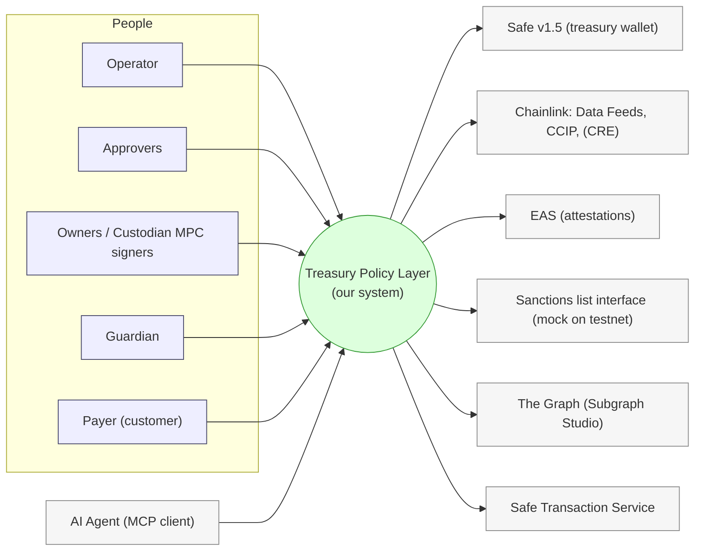
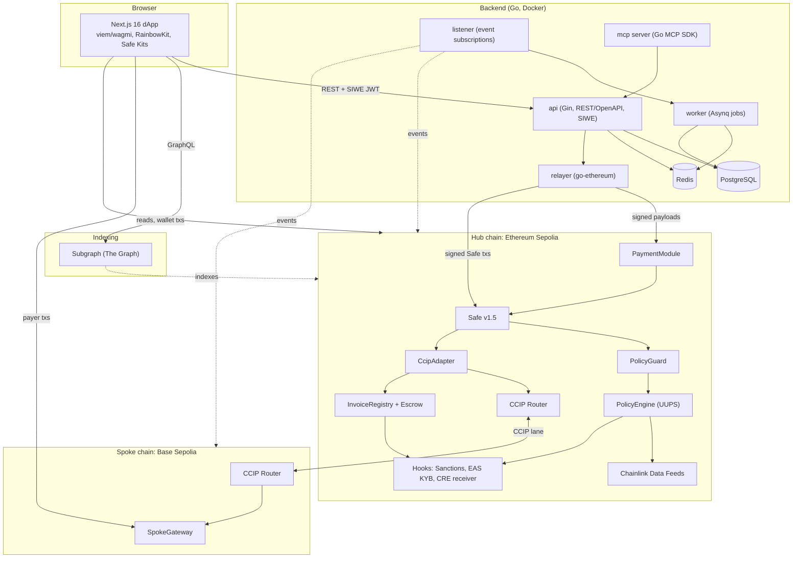
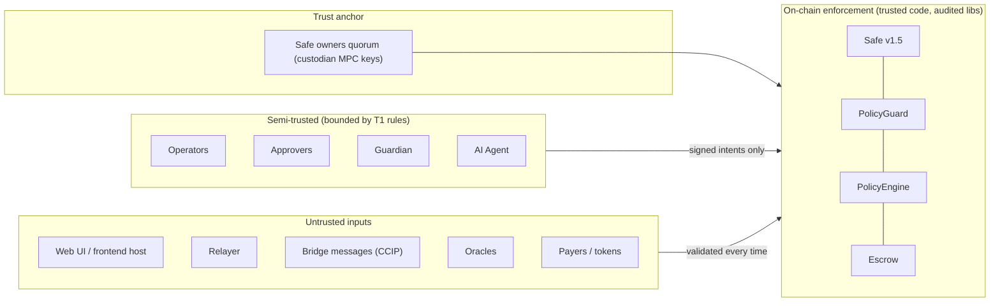
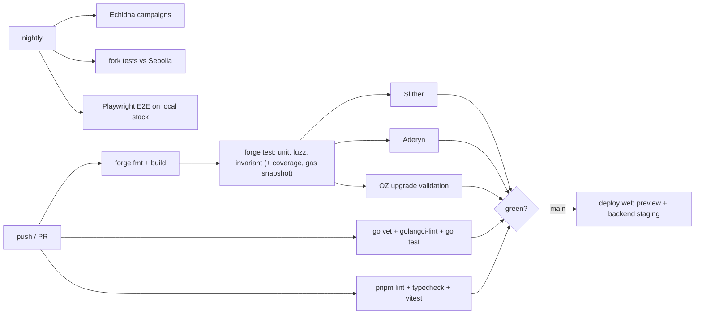

# Step 5c — System Architecture

_Treasury Policy Layer · v1.0 · 2026-09-27. C4-style views (context → containers → deployment), trust boundaries, security architecture, CI/CD, environments, repo layout. Mermaid diagrams. Companion to `05a-PRD.md` and `05b-solution-design.md`._

---

## 1. System context (C4 level 1)



---

## 2. Containers (C4 level 2)



**Container responsibilities**

| Container | Tech | Responsibility | Holds secrets? |
|---|---|---|---|
| Next.js dApp | TS | UI; signs EIP-712 proposals/approvals; payer flows | No (user wallets) |
| api | Go/Gin | Auth, proposals/approvals store, invoices, payees labels, audit | JWT secret |
| relayer | Go/geth | Submit already-signed payloads; gas mgmt | **Hot gas wallet** (low balance, no roles) |
| listener | Go/geth | Chain events → jobs | No |
| worker | Go/Asynq | Reminders, CCIP tracking, alerts, gas bumps | No |
| mcp | Go MCP SDK | Agent tools (read/simulate/propose) | **AGENT key** (propose-only) |
| PostgreSQL | — | Off-chain state | — |
| Redis | — | Job queue | — |
| Subgraph | The Graph | Read model for history | No |
| Hub contracts | Solidity | All policy + escrow + bridge logic | — |
| SpokeGateway | Solidity | Authenticity checks + payouts + payer entry | — |

---

## 3. Trust boundaries



**Rules**
- Nothing in T2 or T3 can move funds beyond what T1 allows.
- The UI and relayer are **untrusted**: approvers verify the decoded intent + hash; the relayer only submits signed data.
- Bridge messages and oracle data are **validated inputs**, never commands (KelpDAO lesson).
- Only the owner quorum can loosen rules, and only through the time-lock (guardian veto).

---

## 4. Deployment view

### 4.1 Environments
| Env | Chains | Purpose |
|---|---|---|
| **local** | Anvil ×2 (hub/spoke) + Chainlink Local CCIP simulator + mock feeds; Docker Compose (Postgres, Redis, api, worker, listener, mcp, web) | Dev + E2E |
| **testnet (primary demo)** | Ethereum Sepolia (hub) + Base Sepolia (spoke) | Pitch/final demo (D15) |
| **fallback** | L2 mainnet (e.g., Base hub + Arbitrum spoke), tiny amounts | Only if testnet feeds/lanes fail (D15); adds the sequencer-uptime check |

### 4.2 Hosting (demo)
| Component | Host |
|---|---|
| Next.js | Vercel |
| api, relayer, listener, worker, mcp (Docker) | Railway or Fly.io |
| PostgreSQL, Redis | Railway/Fly managed add-ons |
| Subgraph | The Graph Subgraph Studio |
| RPC | Alchemy/Infura free tier (+ public fallback) |

### 4.3 Contract deployment order (Foundry scripts, per chain)
**Hub (Sepolia):**
1. Mocks (sanctions list, fixed-price feed) if needed
2. PolicyEngine implementation + ERC1967 proxy (initialize: roles, limits, tokens/feeds, delays)
3. PaymentModule
4. InvoiceRegistry + Escrow
5. Hooks
6. CcipAdapter
7. Safe v1.5 via the proxy factory (owners = demo signers)
8. Safe: enable PaymentModule → set guard + module guard (PolicyGuard)
9. Engine config: payees, allowed targets/selectors, lane/spoke counterpart
10. Grant roles
11. Verify on Etherscan

**Spoke (Base Sepolia):**
1. SpokeGateway (hub selector, CcipAdapter address, lane caps)
2. Verify on Basescan
3. Back on the hub: allowlist the spoke gateway (queued change → execute after the delay)

Deterministic addresses via CREATE2 (e.g., CreateX) where useful; the deployment manifest (`deployments/<chain>.json`) is consumed by the web, api and subgraph.

---

## 5. Security architecture (summary)

| Layer | Controls |
|---|---|
| Keys | Owners = hardware wallets / demo EOAs; relayer = separate low-balance hot wallet (no roles); AGENT key isolated in the mcp container; secrets via env (KMS on the roadmap) |
| Contracts | Guard + module guard on every path; asymmetric time-locked governance; pause; anti-bricking; CEI + ReentrancyGuard; SafeERC20; EIP-712 with domain separation; UUPS only for the engine (time-locked) |
| Cross-chain | Router/source/sender checks; per-lane caps; RMN + token-pool limits; never-revert receivers; pause per lane |
| Oracles | Staleness, deviation, stable floor, fail-to-approval |
| Off-chain | SIWE auth; role checks mirror on-chain roles; rate limits (API, relayer, MCP); simulate-before-send; audit log |
| Monitoring | Alerts: ChangeQueued, Paused, bucket > 80%, lane cap > 80%, stuck CCIP message, relayer gas budget, FLAGGED backlog |

---

## 6. CI/CD



---

## 7. Repository layout (monorepo)
```
treasury-policy-layer/
├─ contracts/            Foundry: src/ (engine, guard, module, escrow, hooks, ccip, spoke), test/ (unit, fuzz, invariant, fork, echidna), script/ (deploy per chain)
├─ subgraph/             The Graph (schema.graphql, mappings, networks.json from deployments)
├─ backend/              Go module: cmd/{api,relayer,listener,worker,mcp}, internal/{policy,chain,store(sqlc),jobs,auth,relayer}, openapi.yaml
├─ web/                  Next.js 16 app (pnpm), generated API client (openapi-typescript), wagmi CLI contract hooks
├─ deployments/          <chain>.json manifests (addresses, block numbers)
├─ docs/                 architecture, SECURITY.md (threat model + Slither/Aderyn triage), runbooks (CCIP manual execution, pause/unpause)
├─ docker-compose.yml    postgres, redis, anvil-hub, anvil-spoke, backend services, web
├─ Taskfile.yml          one-command setup/test/deploy tasks
└─ README.md             local spin-up (≤ 15 min), demo script, roadmap
```

---

## 8. Observability
- Structured JSON logs (Go `slog`), request IDs across api → relayer.
- `/healthz` per service.
- On-chain events → alerts (see §5).
- Dashboard widgets for bucket/lane usage.
- Roadmap: OpenTelemetry traces + metrics.

---

## 9. Architecture decisions index
| Area | Decision |
|---|---|
| Custody base | D9: Safe v1.5 + guard + module |
| Cross-chain | D11: CCIP hub-and-spoke, Model A |
| Policy engine | D12: hybrid core + ≤3 hooks, buckets, tiers, asymmetric governance |
| Receiving side | D13: registry + escrow + compliance hooks |
| Tokens/oracles | D14 |
| Environments | D15 |
| Security/upgradeability | D16 |
| MCP | D17 (Go SDK per D20) |
| Gas | D18 |
| Frontend / Backend | D19 / D20 |
| Positioning | D21 |